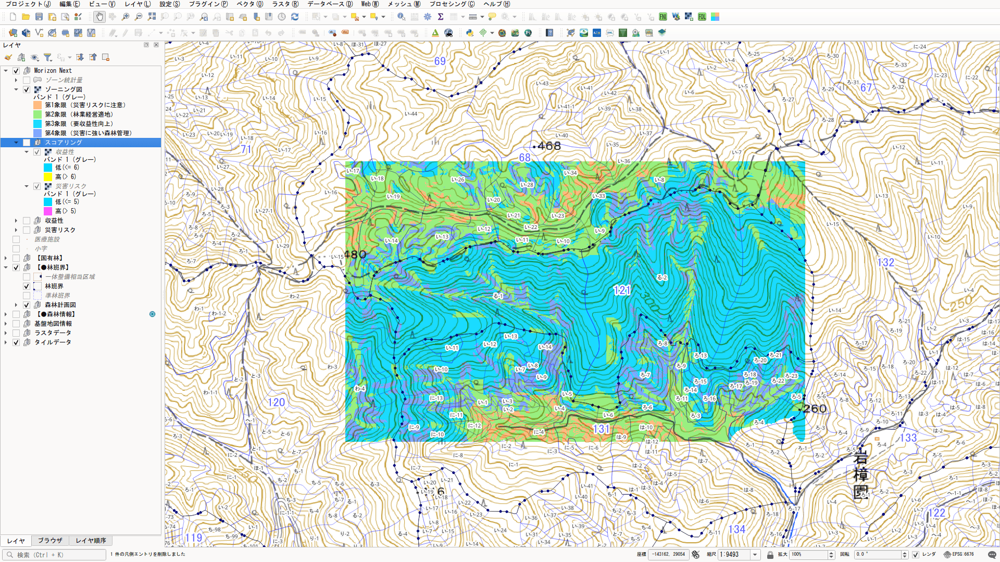
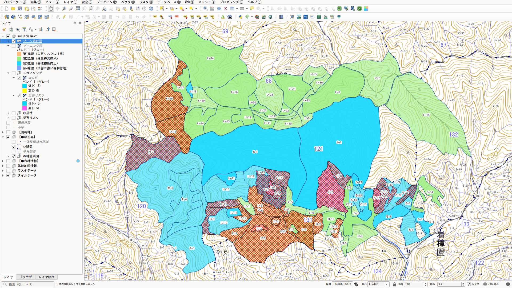
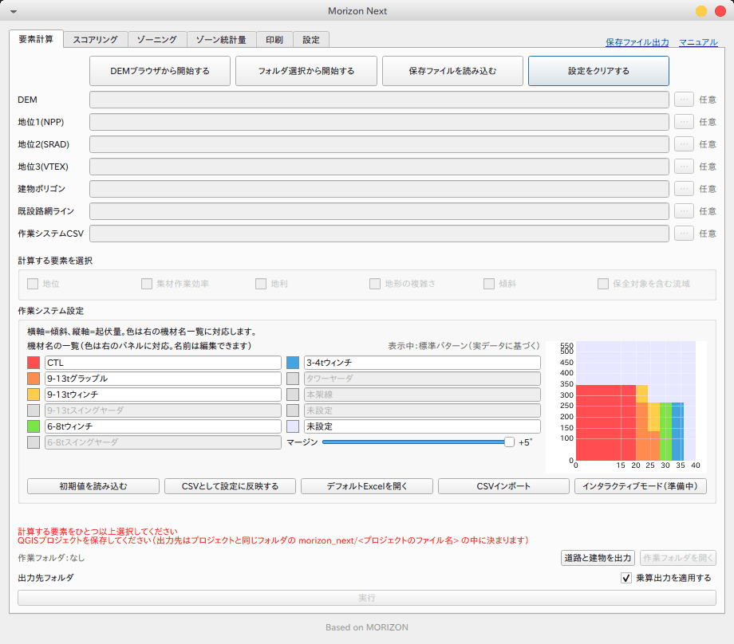

# MORIZON NEXT

収益性と山地災害リスクの両面から森林管理の方向性を検討する、森林ゾーニング支援 QGIS プラグインです。林野庁の森林ゾーニング支援ツール「もりぞん（MORIZON）」を土台とする**非公式の独自継続版**です。

A QGIS plugin for forest zoning that examines forest management direction from two perspectives: forestry profitability and mountain disaster risk. It is an independent, unofficial continuation of MORIZON (もりぞん), a tool originally developed through a project commissioned by the Forestry Agency of Japan.



スコアリング（収益性・災害リスク）からゾーニング図を作った例です。2軸の組み合わせで、森林を4区分に色分けしています。



最終的な出来形（ゾーン統計量）の例です。小班ごとに、ゾーニング結果の4区分のうち最も多い区分で色分けし、災害リスクの高い範囲が3割以上の小班に斜線を重ねています。

---

## 原版との違い

ゾーニングの考え方と計算方法は原版（もりぞん v2.1）を受け継いでいます。主に変えたのは、解析に入る前のデータ準備と、作業の進め方です。

解析の考え方と手順は原版を受け継いでいますが、一部の要素は原版とは別のプログラムで計算しています。また、QGIS・GDAL・GRASS などの版も原版のころと違うため、出力は原版と厳密には一致しません。出来形が原版に近くなるよう努めていますが、原版の結果を再現するものではなく、別の実装として扱ってください。

原版では、DEM の変換・結合、建物や道路のダウンロードと座標変換、作業システム表の Excel 編集などを、すべて手作業で行う必要がありました。MORIZON NEXT では、QGIS の地図で対象範囲を表示してボタンを押せば、これらのデータがそろいます。

| データ | 原版 | MORIZON NEXT |
|---|---|---|
| DEM（標高） | 手動でダウンロード・変換・結合 | 表示範囲を自動取得し、平面直角座標系に変換して保存 |
| 地位データ（NPP・SRAD・VTEX） | ZoningKit を手動でダウンロードして指定 | ZoningKit から表示範囲を自動取得 |
| 建物・道路縁 | 基盤地図情報サイトから手動でダウンロード | 基盤地図情報ダウンロードサービスから自動取得 |
| 作業システム | Excel で編集して CSV を書き出し | プラグイン内の補助画面で設定。原版の Excel ひな形も使える |
| 地形の複雑さの計算 | SAGA を使用 | 既定ではプラグイン内で計算（SAGA が無くてよい） |
| 地利（道路からの距離）の計算 | GRASS を使用 | GDAL で計算（より厳密な距離。計算範囲を絞って高速化） |
| 途中からの再開 | 出力フォルダから各タブで手作業で選び直す | 保存ファイルを読み込むか、QGIS プロジェクトを開いて「再開」を選ぶと、保存時の状態に戻る |

その他の改良：

- QGIS 3.x と 4.x の両方で動作（1つのコードで両対応）
- フォルダ名やユーザー名に日本語が含まれていても動作
- 時間のかかる取得・計算・コピーは、QGIS の画面を止めずに、進捗を表示しながら実行

## 主な機能

画面は原版と同じく、次のタブで構成されています。

- **要素計算**：DEM・地位データ・建物・道路・作業システムから、6つの要素（地位、集材作業効率、地利、傾斜、地形の複雑さ、保全対象を含む流域）を計算
- **スコアリング**：要素ごとに 1〜3 点を付け、収益性と災害リスクの2軸にまとめる
- **ゾーニング**：2軸の組み合わせで森林を4区分に色分け
- **ゾーン統計量**：小班などのポリゴンごとにゾーニング結果を集計し、Shapefile に出力。ゾーニング図と重なるポリゴンだけを処理するので、県全域の森林計画図を選んでも範囲外は照合しません
- **印刷**：印刷レイアウトを作成
- **設定**：地位指数の推定式の係数、区分ごとのスコア（点数）、起伏量・地形の複雑さの計算に使う窓の大きさ、基盤地図情報のログイン情報、地形の複雑さの計算に使うプログラムなどを設定（要素の値を区分に分けるしきい値は、スコアリングタブで設定します）

## 作業の始め方



要素計算タブの上に、作業の始め方ごとのボタンが並んでいます。

| ボタン | 使う場面 | 作業フォルダ |
|---|---|---|
| **DEMブラウザから開始する** | 新しく解析を始める。データを自動取得する | プロジェクト内 |
| **フォルダ選択から開始する** | 原版の ZoningKit 形式のフォルダなど、手元にそろえたデータで始める | 外部（選んだフォルダ） |
| **保存ファイルを読み込む** | 保存した解析を開いて続ける | プロジェクト内、または外部（選んだフォルダ） |
| **設定をクリアする** | 初期状態に戻す | なし |

### 作業フォルダ

入力（`DATA/`）と出力（`YOUSO/`・`ZONING/`・`AGGREGATE/`）を置く場所を「作業フォルダ」と呼びます。今の作業フォルダは、タブ列の右（「設定」タブの隣）に「作業フォルダ：プロジェクト内」「作業フォルダ：外部 ○○」「作業フォルダ：なし」と表示されます。

- **プロジェクト内**：`<QGIS プロジェクトのフォルダ>/morizon_next/<QGIS プロジェクトのファイル名>/` です。同じフォルダに複数の QGIS プロジェクト（qgz）を置いても、プロジェクトごとに分かれます。QGIS プロジェクトを先に保存しておく必要があります
- **外部**：「フォルダ選択から開始する」「保存ファイルを読み込む（フォルダ）」で選んだフォルダです。データはコピーせずその場で使い、出力もそのフォルダに書き込みます（原版のキットの使い方と同じです）
- **なし**：初期状態です（設定をクリアした、QGIS プロジェクトが未保存、など）。出力先は空欄で、要素計算タブの入力欄は使えません。上のボタンのどれかで始めます

構成は原版の ZoningKit と同じです（`AGGREGATE/` だけは MORIZON NEXT で追加したフォルダです）。

```
<作業フォルダ>/
├─ DATA/        入力（DEM/・SiteIndex/NPP/・SRAD/・VTEX/・ROAD/・TATEMONO/・SAGYO-SYSTEM_CSV/）
├─ YOUSO/       要素計算の出力
├─ ZONING/      スコアリングとゾーニングの出力
└─ AGGREGATE/   ゾーン統計量の出力
```

QGIS プロジェクトのフォルダの `morizon_next/` には、プロジェクトごとの作業フォルダのほか、次のものも置きます。

```
<QGIS プロジェクトのフォルダ>/morizon_next/
├─ <QGIS プロジェクトのファイル名>/   プロジェクト内の作業フォルダ
├─ shared/     取得したデータのキャッシュ（同じフォルダのプロジェクトで共有。クリアや破棄の対象外）
└─ archive/    保存ファイル（ZIP）
```

- 出力先は作業フォルダの中に決まり、変更できません。各タブの出力先は文字列で表示し、長い場合は途中を省略します（マウスを重ねると全体を表示）
- 入力欄の「…」でファイルを個別に選ぶと、作業フォルダの `DATA/` の該当フォルダにコピーして使います。同じ種類の前のファイルは置き換えます（外部フォルダの中を置き換えるときだけ確認が出ます）

### レイヤーの初期化と片付け

- 「DEMブラウザから開始する」「フォルダ選択から開始する」「設定をクリアする」を押したとき、「保存ファイルを読み込む」で項目を選んだときは、「レイヤーを初期化します」と確認し、Morizon Next のレイヤーを、指しているファイルの場所に関係なくすべてプロジェクトから外します（ファイルは残ります）。フォルダや ZIP を選ぶ読み込みでは、選んだ後に確認します
- 要素計算などの各工程では、作るものと同じ種類のレイヤーだけを外してから作り直します。上書きの確認でキャンセルした場合は、外したレイヤーを元の位置に戻します

### 1. 自動取得から始める（DEMブラウザから開始する）

1. QGIS プロジェクトを保存します
2. 地図を対象範囲に合わせます。表示している範囲が取得範囲になります
3. 「DEMブラウザから開始する」を押して DEM の取得元を選ぶと、DEM → 地位データ → 建物・道路縁の順に取得します。静岡県・長野県では、県のオープンデータの高解像度 DEM も選べます
4. 作業システムを設定し（下記）、要素計算を実行します
5. スコアリング → ゾーニング → ゾーン統計量 → 印刷へ進みます

### 2. 従来のフォルダから始める（フォルダ選択から開始する）

原版の ZoningKit のフォルダ（またはその中の `DATA` フォルダ）を選びます。使う入力の一覧（DEM の有無、同じ種類のファイルが複数あるもの）を確かめてから始められます。各サブフォルダにはファイルを1つだけ置いてください（複数あると名前順で最初のものを使います）。

選んだフォルダに出力（`YOUSO/`・`ZONING/`・`AGGREGATE/` のファイル）がある場合は、途中まで進んだフォルダとして読み込み、出力をレイヤーに反映します（「保存ファイルを読み込む」でフォルダを選んだときと同じ動きです）。

DEM は平面直角座標系（単位 m）の GeoTIFF を使ってください。緯度経度や Web メルカトルの DEM では、傾斜・距離・面積が正しく計算されません。

## 解析の進め方（保存と再開）

1つの QGIS プロジェクトで扱う解析は1つです。解析は完了まで進めて保存し、それから次の範囲を始めます。

### 途中でやめる・続ける

作業フォルダは QGIS プロジェクトに記録されます。QGIS プロジェクトを保存して開き直すと、「前回 ○○ で作業していました。再開しますか？」と確認します（プラグインの画面を開いていない場合は、画面を開いたときに確認します）。

- **はい**：プロジェクト内なら、プロジェクト内のデータを読み直して再開します。外部なら、作業フォルダをそのフォルダに戻して再開します（レイヤーはプロジェクトに保存されていたものをそのまま使います）
- **いいえ**：レイヤーを初期化して、初期状態（作業フォルダ：なし）にします
- **外部のフォルダが見つからない場合**（移動した、別の PC で開いた、など）：プロジェクト内にデータがあれば、そこから再開します。無ければ、その旨を知らせて初期状態にします。フォルダを移動したときは、「保存ファイルを読み込む」でフォルダを選び直してください
- 作業フォルダを記録していないプロジェクトは、初期状態で開きます

### 保存する（保存ファイル出力）

タブ列の右端の「保存ファイル出力」で、入力と出力をまとめて ZIP に保存します。保存先は `<QGIS プロジェクトのフォルダ>/morizon_next/archive/<QGIS プロジェクトのファイル名>_<日時>.zip` です（ZIP の中も上の作業フォルダと同じ構成で、説明ファイル `MORIZON_NEXT.txt` が入ります）。作業フォルダがプロジェクト内のときは、保存後にプロジェクト内の作業フォルダのデータとプラグインのレイヤーをクリアし、次の解析を始められる状態にします（スコアリングの設定値は残ります）。

保存しないまま「DEMブラウザから開始する」を押すと、プロジェクト内に前の解析のデータがある場合は、破棄してよいかを確かめます。残したい場合は、キャンセルして先に保存してください。破棄は DEM ブラウザで範囲を決めた後に行うので、DEM ブラウザで取りやめた場合、データは変わりません（レイヤーは最初に初期化しています）。

### 保存した解析を開く（保存ファイルを読み込む）

「保存ファイルを読み込む」では、次の3つから選べます。

- **プロジェクト内のデータを読み直す**：プロジェクト内の作業フォルダの内容で、各タブを戻します
- **ZIP を選んで読み込む**：保存した ZIP をプロジェクト内の作業フォルダに取り込みます（プロジェクト内の保存されていないデータは置き換わります）。作業フォルダはプロジェクト内になります
- **フォルダを選んで読み込む**：保存データを展開したフォルダや、原版のキットのフォルダ（出力の `YOUSO/`・`ZONING/` を含むもの）を、その場で外部の作業フォルダとして使います（コピーしません。プロジェクト内のデータには触れません）

読み込むと、要素計算の入力、各タブの出力先、スコアリングのしきい値（`params.json`）、出力レイヤーが、保存したときの状態に戻ります。途中までの解析も、その段階から続けられます。原版で作った出力も読み込めます。出力の上書きは、各工程を実行するときに確認します。

### 設定をクリアする

「レイヤーを初期化します」の確認で、「プラグインフォルダ内の個別データを削除」を選ぶと、プロジェクト内の作業フォルダのデータも削除します（キャッシュの `shared/` と保存ファイルの `archive/` は残ります）。作業フォルダは「なし」になり、QGIS プロジェクトの記録も消します。

## 作業システムの設定（補助画面）

要素計算タブの「作業システム設定」（[作業の始め方](#作業の始め方)の画面の下半分）で、傾斜と起伏量の組み合わせごとに使う機材を設定します。原版のように Excel を編集する必要はありません。

- **色分布パネル（右）**：横軸が傾斜、縦軸が起伏量です。色が、その地形に割り当てる機材を表します。デフォルトは、原版の Excel ひな形の「入力例」シートと同じ内容です
- **機材名の一覧（左）**：色と機材の対応です。色の四角をクリックすると「保有していない機材」になり、その機材が割り当てられていた地形は「該当なし」になります
- **マージン**：斜面を実際より最大3度緩く（または厳しく）見なして、割り当てを調整します
- **ボタン**：
  - Excelシートを開く（原版の「集材作業効率の設定」Excel を作業フォルダに置いて開く。上書き保存すると、その内容がパネルと一覧に読み込まれる）
  - CSVとして反映する（作業フォルダの `DATA/SAGYO-SYSTEM_CSV/costcsv.csv` に書き出し、入力欄に設定）
  - CSVインポート（CSV のパターンと機材名をパネルに読み込む）
  - デフォルトに戻す
  - インタラクティブモード（準備中）：凡例で機材を選び、パネルを直接クリック・ドラッグして割り当てる機能の予定です

地域の作業システムをマスごとに細かく決めたい場合は、「Excelシートを開く」で開いた Excel の「入力」シートを編集して上書き保存し、パネルと一覧で表示を確かめてから「CSVとして反映する」を押してください。

## 計算に使うプログラムの原版との違い

ゾーニングの考え方と各要素の意味は原版のままです。次の2つの要素は、原版とは別のプログラムで計算しています。

### 地形の複雑さ（SAGA）

地形の複雑さ（平面曲率の標準偏差）の前半の処理（DEM の平滑化と平面曲率）は、既定ではプラグイン内で計算します。設定タブの「Morizon Next 設定」にある「地形の複雑さの計算」で切り替えられます。

- **SAGA OFF（既定）**：MORIZON v2.1（QGIS 3.16 + SAGA 2.3）の結果に沿うよう、プラグイン内で計算します。サンプルデータで v2.1 の出力と照合し、3区分（三分位）の一致率は約98%でした（違いは外周とデータの無いセルの周りに集中しています）。SAGA は不要です
- **SAGA ON**：MORIZON v2.1 の指定のまま SAGA に渡します。現行の SAGA（プラグイン「Processing Saga NextGen Provider」経由の SAGA 9）はこの指定に対応していないため、v2.1 の結果と相違が大きく出ます（同じ照合で一致率は約50%）。本家が現行 SAGA 向けに指定を決め直した場合に対応するため、経路を残しています

SAGA ON にするには、QGIS のプラグイン「Processing Saga NextGen Provider」と SAGA 本体（9.2.0 以上）が必要です。ON に切り替えたときと要素計算の実行前に、両方があるかを確かめ、足りなければ案内します。

### 地利（GDAL）

地利は、各セルから一番近い道路までの水平距離です（原版と同じ）。

- **プログラム**：原版の GRASS（r.grow.distance）に代えて、QGIS に組み込まれている GDAL（proximity）で計算します。サンプルデータ（1m DEM）で厳密なユークリッド距離と照合したところ、proximity はほぼ一致し（外れは 0.1% のセルで 0.21m 以内）、r.grow.distance は約 5% のセルで一番近い道路より少し遠い道路で測っていました（最大 7.3m）。そのため MORIZON NEXT の地利は、原版の出力と比べて、約 5% のセルで値が小さく（一番近い道路までの正しい距離に）なります
- **計算範囲**：自動取得の道路は、DEM の周りの道路も効くよう広めに取得しています。距離は、取得した道路の範囲全体ではなく、DEM ＋ その対角線の長さの範囲に絞って計算します（DEM の中に道路が1本でもある場合。無い場合は絞りません）。DEM の中の各セルにとって一番近い道路はこの範囲の中にあるので、範囲を絞っても、原版と同じ広い範囲で計算した場合と結果は変わらない理屈です。サンプルデータでは、全セルで結果が一致し、計算時間は約30秒から約3秒に短くなりました
- **取得範囲に道路地物が無い場合**：基盤地図情報から取得した道路データに有効な道路地物が1件も無い場合は、道路欄に空の Shapefile を設定し、地利は DEM 全域を道路から遠い条件（1点相当）として作成します。実際の林道・作業道を反映する場合は、独自の道路データの作成をおすすめします（作業フォルダの道路データに描き足して計算し直す手順は、操作マニュアル「2.2 高度な使い方」）。公式の手引：収益性と災害リスクを考慮した森林ゾーニングの手引き（令和8年3月）（https://www.geospatial.jp/ckan/dataset/84476079-c049-4b8f-b46a-3280e9bc2cc4/resource/a4d0ae9c-36e8-48c6-8474-3d1d4312e061/download/shinrin_zoning_tebiki_r8.pdf?preview=1）参照ページ：p.42〜43/p.71〜72

## レイヤーの配置と表示

出力レイヤーは、レイヤーパネルの最上位の「Morizon Next」グループにまとめて追加します。

```
Morizon Next
├─ ゾーン統計量
├─ ゾーニング図
├─ スコアリング        収益性・災害リスク
├─ 収益性             地位（スギ・ヒノキ・カラマツ）・集材作業効率・地利
│   └─ 各要素          生データ／スコアリング
└─ 災害リスク          地形の複雑さ・傾斜・保全対象を含む流域
     └─ 各要素          生データ／スコアリング
```

一部のグループは QGIS 標準の「排他グループ」（中の1つだけを表示する設定）にしています。

| グループ | 排他 | 理由 |
|---|---|---|
| 各要素の中（生データ／スコアリング） | あり | 同じ要素の2つの表示は重ねる意味が無いため |
| 収益性（要素どうし） | あり | 地位・集材作業効率・地利は1つずつ見るため |
| 災害リスク（要素どうし） | なし | 傾斜をベースに、地形の複雑さ・保全対象を含む流域を重ねて確認するため |
| スコアリング | なし | 収益性と災害リスクを重ねて確認するため |

注意：

- 排他グループの中では、どれかにチェックを入れると、同じグループのほかのチェックが自動で外れます。重ねて見たい場合は、排他になっていないグループで行うか、レイヤーパネルのグループの右クリックメニューで排他の設定を外してください
- 追加したときは、各要素の生データにチェックが入り（地利だけはスコアリング）、グループは閉じた状態・表示 OFF になっています。グループにチェックを入れると表示されます
- 出力は既定で乗算で描画します（原版と同じ）。重ね順に関係なく重ねて見られます。要素計算タブの「乗算出力を適用する」を外すと通常の描画になり、重ね順と不透明度の調整が必要になります
- この配置と排他の設定はプロジェクトに保存されます

## 動作要件

- QGIS 3.44 以降（4.x を含む）
- 自動取得を使う場合はインターネット接続
- 建物・道路縁の自動取得には、国土地理院「基盤地図情報ダウンロードサービス」の利用者登録（無料）が必要です。登録した ID とパスワードをプラグインのログイン画面で入力します
- 地形の複雑さを SAGA で計算する場合（SAGA ON）のみ、QGIS のプラグイン「Processing Saga NextGen Provider」と SAGA 本体 9.2.0 以上
- スコアリングの統計画面のヒストグラム表示には matplotlib を使います。matplotlib が入っていない環境（Flatpak 版 QGIS など）では、ヒストグラムを省略して数値の統計だけを表示します

## インストール

1. このリポジトリをダウンロードまたはクローンします
2. フォルダ名を `morizon_next` にして、QGIS のプラグインフォルダに置きます
   - Windows: `%APPDATA%\QGIS\QGIS3\profiles\default\python\plugins\`
   - Linux: `~/.local/share/QGIS/QGIS3/profiles/default/python/plugins/`
   - QGIS 4.x ではプロファイルの場所が異なる場合があります。QGIS の「設定 > ユーザープロファイル > アクティブなプロファイルフォルダを開く」で確認してください
3. QGIS を再起動し、「プラグイン > プラグインの管理とインストール」で MORIZON NEXT を有効にします

起動はメニューの「ラスタ > Morizon Next」、またはラスタツールバーのアイコンから行います。

操作については、同梱の簡易 [操作マニュアル](docs/manual.html) を参照してください（現在は「データの準備」の章のみ。他の章は準備中です）。

## 注意事項

- **地位データは平面直角座標系の第1〜13系の地域だけで提供されています。** 第14〜19系（沖縄の一部、小笠原など）では自動取得できないので、手元のデータを指定してください
- 基盤地図情報の道路縁に林道・作業道が載っていない地域では、地利は実際より低く評価されます。取得した道路データに有効な道路地物が無い場合は、地利を全域1点相当で作成します
- 取得した建物データに建物が無い場合は、保全対象を含む流域を、どの流域にも保全対象が無い条件（全域0）として作成します
- 1つのプロジェクトで扱う解析は1つです。次の範囲を始める前に、「保存ファイル出力」で保存してください（[解析の進め方](#解析の進め方保存と再開)）
- ゾーニング図に入るのは、地図上で数値として計算できるものだけです。材の質、所有者の意向、法令による規制、土砂災害警戒区域、過去の災害履歴などは含まれません。ゾーニング図は結論ではなく、関係者が話し合うためのたたき台として使ってください

## データの出典

自動取得するデータの出典は次のとおりです。成果を資料にするときは出典を明記してください。

| データ | 出典 |
|---|---|
| DEM | 国土地理院（地理院タイル 標高タイル DEM1A / DEM5A / DEM10B） |
| DEM（静岡県内で選択時） | 静岡県「VIRTUAL SHIZUOKA」航空レーザ測量データ LP/Grid（G空間情報センター、CC BY 4.0） |
| DEM（長野県内で選択時） | 長野県建設部砂防課 航空レーザ測量成果 0.5mメッシュDEM（令和3〜7年度）、長野県林務部 航空レーザ測量成果 0.5mメッシュDEM（2013〜2014年度）（いずれも G空間情報センター） |
| 建物・道路縁 | 国土地理院 基盤地図情報（建築物の外周線、道路縁） |
| NPP・SRAD・VTEX | 林野庁「森林ゾーニング支援ツール もりぞん」ZoningKit（G空間情報センター）。地位指数の推定式は光田靖・北原文章（2017）による |

ゾーニング図を印刷して配布する場合など、使い方によっては国土地理院への利用手続きが必要になることがあります。事前に国土地理院の案内で確認することをお勧めします。

## ライセンス・謝辞

GNU General Public License v3（[LICENSE](LICENSE)）。原版もりぞんのライセンス（GPL v3）を継承しています。

本プラグインは GPL v3 に基づき**無保証**で提供します（GPL v3 第15条・第16条）。利用に伴って生じたいかなる結果についても、原版の作者（林野庁・日本森林技術協会・MIERUNE Inc.）と改変者は責任を負いません。

原版から改変したファイルには、改変した旨を冒頭に記しています。改変は 2026-09-29（原版 v2.1 の取り込み）から行っており、変更の内容と日時は GitHub のコミット履歴で確認できます。

原版「もりぞん」は、林野庁の委託事業において、日本森林技術協会がゾーニングの考え方と作業フローを取りまとめ、MIERUNE Inc. が QGIS プラグインとして実装したものです（Copyright (C) 2021 MIERUNE Inc.）。原版は [G空間情報センター](https://www.geospatial.jp/ckan/dataset/rinya-morizon-dateset) で配布されています。

MORIZON NEXT は日本森林技術協会または林野庁による公式版ではなく、両者による保証・サポートの対象でもありません。著作権と帰属の詳細は [NOTICE](NOTICE) を参照してください。

改変：Copyright (C) 2026 Hideharu Masai

## 不具合報告

[GitHub Issues](https://github.com/raw-slnc/morizon_next/issues) で受け付けています。個人で開発しているため、すべての報告に対応できるとは限りません。

不具合は、使う環境や設定によって起きることが多く、同じ環境を用意しないと確かめられません。対応を検討するには、次の情報が必要です。

- QGIS のバージョンと OS
- MORIZON NEXT のバージョン
- 操作の手順（どの画面で何をしたか）
- エラーメッセージ（QGIS の「ログメッセージ」パネルの内容）
- 使ったデータの種類（自動取得か、手持ちのデータか）
- 追加している QGIS プラグインの一覧
- 追加した Python ライブラリ。自分で入れたものと、プラグインの機能で自動的に入ったものの両方を書いてください
- 上記の追加プラグインとライブラリを外し、[動作要件](#動作要件)に書いたものだけの環境で試した結果

頂いた情報で再現しない、判断ができない報告には対応ができないことがあります。
